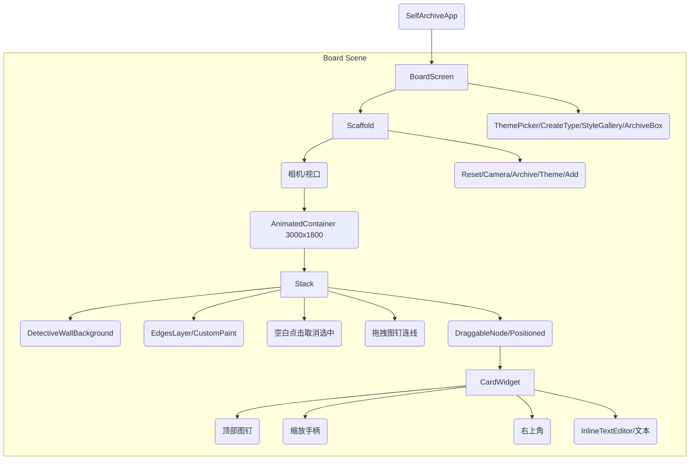

# UI 结构图

## 组件层级说明
1. **BoardScreen**: 顶层页面，负责相机状态、节点选择与弹层（底部弹窗）。
2. **InteractiveViewer**: 提供画布平移/缩放与世界坐标映射。
3. **EdgesLayer**: 通过 `CustomPaint` 绘制连线与绳子纹理。
4. **DraggableNode**: 处理拖拽、缩放与卡片选择状态。
5. **CardWidget**: 渲染卡片样式、内容编辑、缩放手柄与删除按钮。
